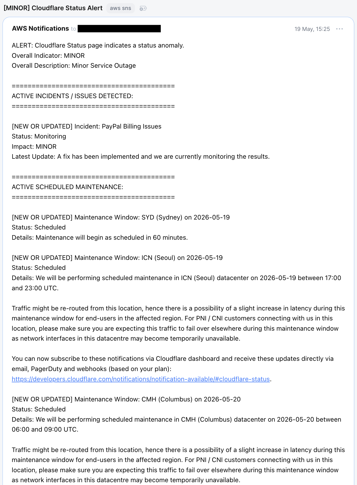
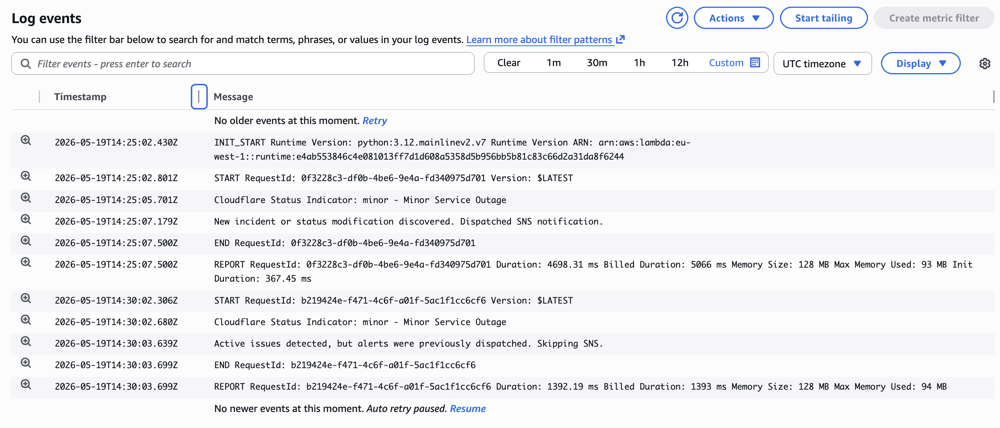
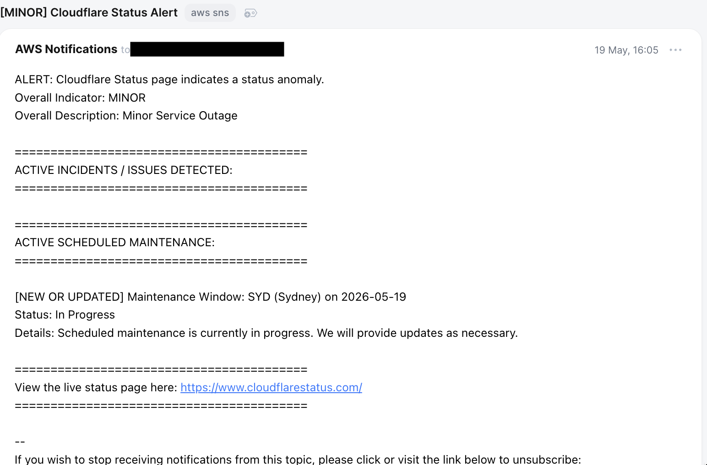

# Cloudflare Status Monitor & Alerter

Self-contained Terraform configuration that deploys a serverless workflow to monitor Cloudflare's operational status. It tracks active disruptions, logs real-time operational metrics, and dispatches single-instance email notifications via an existing SNS topic when issues emerge or update.

## Architecture Overview

* **Trigger (Amazon EventBridge):** A cron schedule executes the tracking workflow every 5 minutes.
* **Compute (AWS Lambda):** A lightweight Python 3.12 function that queries Cloudflare’s Statuspage Summary API.
* **State Cache (Amazon DynamoDB):** A serverless key-value store that tracks previously alerted incidents to prevent notification fatigue.
* **Metrics (Amazon CloudWatch):** Custom operational metrics track the presence of infrastructure incidents over time.
* **Alerting (Amazon SNS):** Integrates with your pre-configured SNS topic to instantly notify downstream subscribers.

---

## Metric Tracking Logic

The infrastructure publishes a custom metric to Amazon CloudWatch under the namespace "Cloudflare/Status" with the metric name "ActiveIncidents".

* 0 (Operational): Published when Cloudflare reports a completely clear status ("indicator": "none").
* 1 (Degraded / Maintenance): Published when any level of disruption (minor, major, critical) or ongoing maintenance is reported.

Note: Metrics are updated continuously every 5 minutes, ensuring your CloudWatch dashboard graphs show the true, continuous duration of an outage even while email alerts are being suppressed.

---

## Intelligent De-duplication Cache

To avoid spamming subscribers every 5 minutes during a prolonged outage, a DynamoDB tracking layer is used:

1. State Isolation: The Lambda loops through individual items in the incidents and scheduled_maintenances blocks.
2. Composite Clustering: A unique cache key is generated for each issue combining its unique identifier and its last-updated timestamp:
   `Cache Key = type_[id]_[updated_at]`
3. Delta Detection:
   * If the key exists in DynamoDB, the alert is silently skipped.
   * If a new incident appears—or an existing incident is updated by Cloudflare (e.g., from Investigating to Identified)—the timestamp changes, generating a new key. An email is sent immediately.
4. Auto-Cleanup: Every entry is written with a Time-To-Live (TTL) timestamp set to 7 days. AWS automatically deletes old cache entries without incurring operational costs.

---

## Inputs & Configuration

The deployment can be customized using the following Terraform input variables:

| Variable Name | Type | Default | Description |
| :--- | :--- | :--- | :--- |
| aws_region | string | `eu-west-1` | The target AWS region for deployment. |
| sns_topic_arn | string | Required | The full ARN of your pre-configured, existing SNS topic. |
| environment | string | `env` | Environment suffix used for unique resource naming (e.g., prod, staging). |
| cloudflare_status_api_url | string | `https://yh6f0r4529hb.statuspage.io/api/v2/summary.json` | Cloudflare's summary payload endpoint. |

---

## Deployment Playbook

1. Initialization

    Prepare your local directory and pull down the required AWS and Archive providers: `$ terraform init`

2. Plan Verification

    Generate an execution plan to verify the infrastructure resources being built:
    `$ terraform plan -var="sns_topic_arn=arn:aws:sns:eu-west-1:123456789012:your-existing-topic" -var="environment=prod"`

3. Application

    Deploy the environment. Pass your pre-existing SNS topic target directly into the runtime variables:

    `$ terraform apply -var="sns_topic_arn=arn:aws:sns:eu-west-1:123456789012:your-existing-topic" -var="environment=prod"`

---

## Verification & Troubleshooting

* Testing Outage Behavior:

  To test the notification flow without waiting for a real Cloudflare outage, you can provision a mock status URL (such as a local mock endpoint or a temporary Webhook tool) and pass it to the cloudflare_status_api_url variable during a temporary apply.
* Checking Execution Logs:

  Raw operational output, execution times, and API parsing metadata are recorded inside the /aws/lambda/cloudflare-status-checker-[env] CloudWatch Log Group.

---

## Screenshots

Initial Alert email:

CloudWatch logs - shows no repeated alerts, due to DDB tracking:

Next alert email - only new ones:

